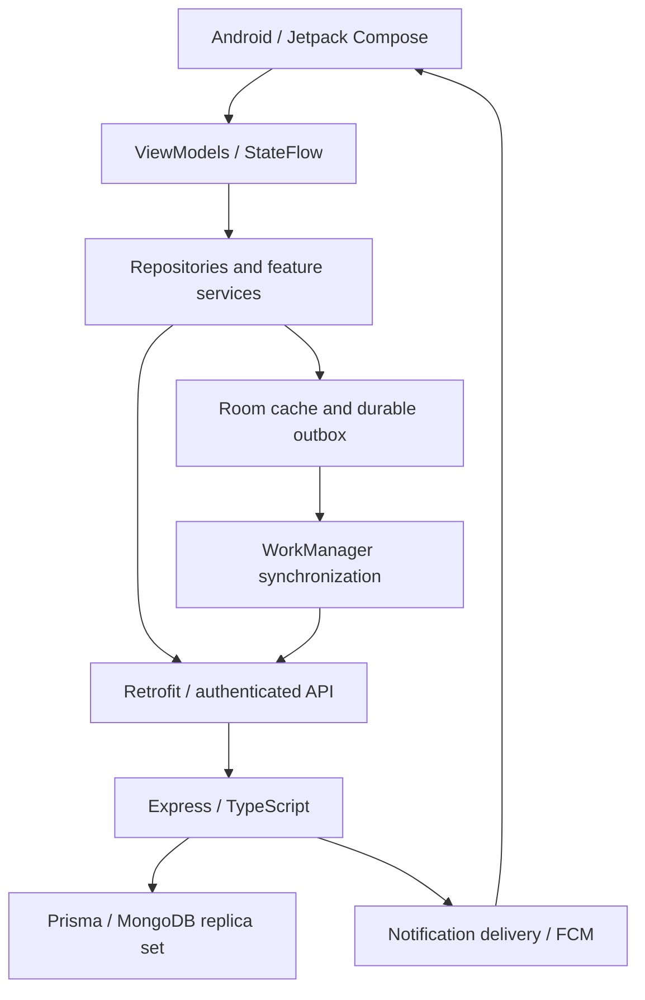

# Kabadiwala Connect

An Android app that connects **Households → Kabadiwalas → Recyclers** through scrap listings, pickups, inventory, offers and recorded handovers.

## Current beta

| Item | Value |
| --- | --- |
| App version | **0.1.12-beta** |
| Android version code | **76** |
| Published APK variant | `envTestingDebug` |
| Household pickup hours | **7:30 AM–9:30 PM, Asia/Kolkata** |
| Update manifest | [`backend/app-update/update.json`](backend/app-update/update.json) |

This is a beta project. A successful build does not establish that every workflow, device or network condition is verified. The testing APK is not a signed production release.

## Who uses it?

- **Household:** create a listing with photos, find nearby collectors, request a pickup, review final weight and amount, and confirm payment receipt.
- **Kabadiwala / Collector:** accept and schedule pickups, verify the Household QR, record weighing, manage inventory, publish bulk lots and handle Recycler offers.
- **Recycler:** submit facility authorization details for review, browse lots, make offers, publish procurement demands, verify handovers and record settlement payments.
- **Admin:** review Recycler authorization and operate permission-controlled administrative tools. Admin access requires an online authenticated session.

Recycler marketplace access depends on server-side authorization. Account roles, resource ownership and transaction rules are enforced by the backend.

## How the journey works

1. A Household creates a scrap listing and uploads its photos.
2. A Collector accepts the pickup, schedules it, starts the trip and marks arrival.
3. QR verification links the collection to the Household record.
4. Final weighing and pricing establish the transaction amount; payment recording and receipt confirmation are separate steps.
5. Collected material enters Collector inventory and can be reserved in a bulk lot.
6. A Recycler makes an offer. Accepted terms lead to handover, material receipt and settlement records.

A photo-less Household listing remains a draft. Listed prices are estimates until final weighing and settlement. A QR verifies a recorded handover; it is not government certification. Material receipt alone does not prove payment was received.

## Architecture



| Directory | Purpose |
| --- | --- |
| `android_app/` | Kotlin, Compose, Material 3, navigation, Room, Retrofit and WorkManager |
| `backend/` | Express API, authentication, business rules, Prisma schema and tests |
| `backend/app-update/` | Downloadable beta APKs and update manifest |
| `docs/` | Workflow notes and historical verification records |
| `design/` | Brand and interface references |
| `.github/workflows/` | CI build, test, secret scanning and container checks |

The Android cache and outbox are account-scoped. Session and request-generation checks prevent late responses from replacing a newer account's state. Notifications check recipient identity and role before display.

## Offline behavior

Cached content can remain usable during network loss. Supported drafts and eligible messages in existing conversations can be queued for later synchronization. Pending, failed and confirmed states must remain distinguishable.

**Pickup acceptance, QR verification, inventory transfer and payment confirmation require online server confirmation.** Queued work must not be presented as completed. Legacy queued acceptance or handover confirmation requires explicit online reconciliation.

Offline support is limited to implemented cache and replay contracts. Complete process-death, reconnect and cross-role runtime acceptance remains separate from storage/unit-test coverage.

## Languages and accessibility

The app includes English and **20 additional locale resource packs**, with a saved language preference. Resource completeness checks do not certify translation accuracy or guarantee that every dynamic server message is translated.

Compose screens use light/dark themes, scrolling forms and accessible controls. Small-screen and large-font checks exist; complete device and accessibility coverage is still required before production acceptance.

## Backend setup

Requirements: **Node.js 20+, npm and MongoDB configured as a replica set**. Atlas supports the transactions used by the app; a standalone local MongoDB instance does not.

From PowerShell:

```powershell
cd backend
Copy-Item .env.testing.example .env
npm ci
npm run db:generate
```

Edit the untracked `.env` for your environment. Set `DATABASE_URL`, a strong `JWT_SECRET`, a separate `TRACEABILITY_SIGNING_SECRET` and the storage configuration. The example database hostname `database` refers to the Docker service; replace it when using Atlas or another host.

Prepare required indexes and start development:

```powershell
npm run db:prepare
npm run dev
```

The API listens on the configured `PORT` (example: `4000`) under `/api/v1`. Readiness is exposed at `/api/v1/ready`.

For a **new disposable database**, Prisma schema preparation can be run before index preparation. Do not blindly run `prisma db push` against an existing deployment: review its schema/index changes and back up data first. Explicit index preparation fails when required maintenance cannot complete.

A local testing replica-set configuration is provided in [`backend/compose.testing.yml`](backend/compose.testing.yml). Development and performance seeds must use isolated testing databases.

## Android setup and APK build

Open `android_app/` in Android Studio with the installed Android SDK and a compatible Gradle JDK. The project uses SDK 37 and supports Android 6.0+ (`minSdk 23`).

Build a testing APK against your own API:

```powershell
cd android_app
.\gradlew.bat :app:assembleEnvTestingDebug -PtestingApiBaseUrl=http://10.0.2.2:4000/api/v1/
```

`10.0.2.2` is the Android emulator's route to the host computer. A physical phone needs a reachable LAN address or HTTPS staging host. Override the endpoint explicitly; the checkout's testing configuration may target a remote test server.

Output:

```text
android_app/app/build/outputs/apk/envTesting/debug/app-envTesting-debug.apk
```

For production, use the `production` flavor, an explicit HTTPS `productionApiBaseUrl`, and protected signing properties. Keep signing files, passwords, database URLs and provider credentials out of Git. An update must be signed with the same key as the installed app.

## Checks

```powershell
# From backend/
npm run build
npm run lint
npm test

# From android_app/
.\gradlew.bat :app:testEnvTestingDebugUnitTest
.\gradlew.bat :app:lintEnvTestingDebug
.\gradlew.bat :app:connectedEnvTestingDebugAndroidTest

# From repository root
node android_app/check-localization.mjs
```

Database integration tests are opt-in and require isolated fixtures. The performance fixture is deterministic and supports large histories, offers, demands, messages and notifications. Do not seed an application database with synthetic load data.

Recent checks passed **258 backend tests** and **169 Android unit tests**. These are point-in-time results, not a guarantee for every future commit. Emulator acceptance and physical-device performance targets are not fully complete. Historical details live in [`docs/README.md`](docs/README.md); its older counts and screenshots should not be interpreted as current release certification.

## Updating the beta channel

1. Increase `versionCode` and `versionName` in `android_app/app/build.gradle.kts`.
2. Build the intended variant against the intended backend.
3. Copy the resulting APK into `backend/app-update/` with a versioned filename.
4. Update `update.json` with the same version, APK filename, SHA-256 checksum, size and release notes.
5. Publish both files to the backend's `/app/` update path.

GitHub source pushes do not automatically deploy a running backend. Deploy backend changes before clients that depend on new endpoints, and run reviewed database/index preparation as part of deployment. Room schema version 30 includes the non-destructive conversation-cache migration from version 29.

The Android app asks before downloading an update; Android controls installation confirmation.
